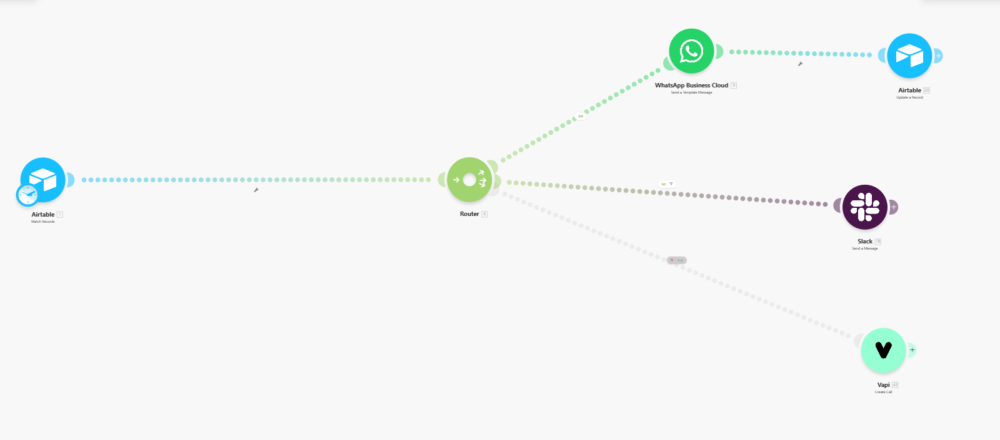
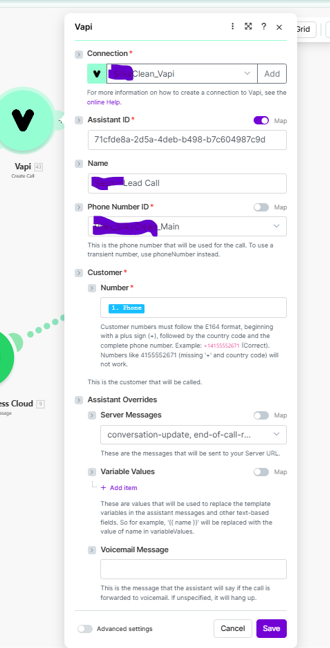
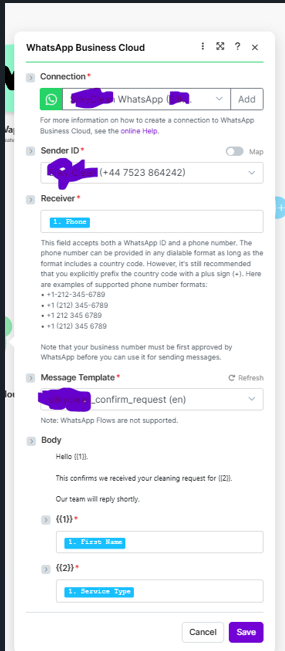
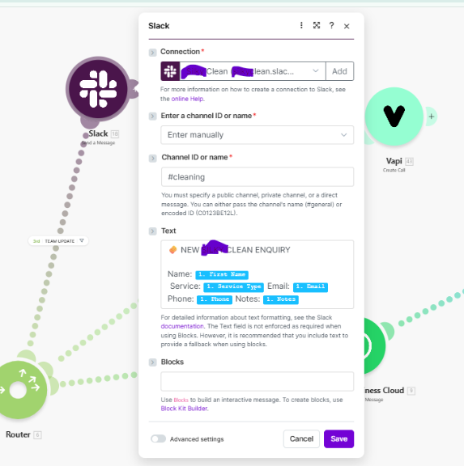
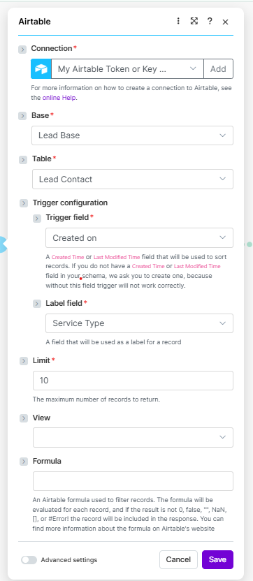
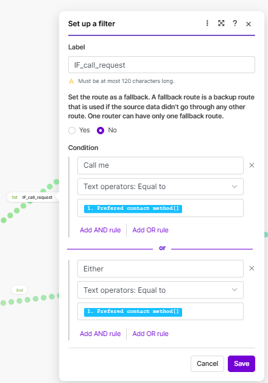

# AI Service Lead Router

AI-powered lead routing automation using **Make.com**, **Airtable**, **Vapi voice agents**, **WhatsApp Business API**, and **Slack alerts**.

This system routes incoming service leads to the correct communication channel based on customer contact preference.

---

# System Architecture

---

# Automation Modules

## Vapi Voice Agent Call

AI voice assistant automatically calls the lead when the preferred contact method is **Call**.

---

## WhatsApp Customer Confirmation

If the lead prefers WhatsApp, the system sends a confirmation message.

---

## Slack Team Notification

Internal team notification for new leads.

---

## Airtable Lead Trigger

New leads captured in Airtable trigger the automation.

---

## Router Decision Logic

Router decides which automation path to trigger based on contact preference.

---

# Technologies Used

- Make.com (automation orchestration)
- Airtable (lead database)
- Vapi (AI voice assistant)
- WhatsApp Business API
- Slack alerts

---

# Purpose

This automation demonstrates a **multi-channel AI customer engagement workflow** capable of routing leads to voice AI or messaging automatically.

---

# Notes

Sensitive credentials such as API keys and webhook URLs are excluded from this repository.
